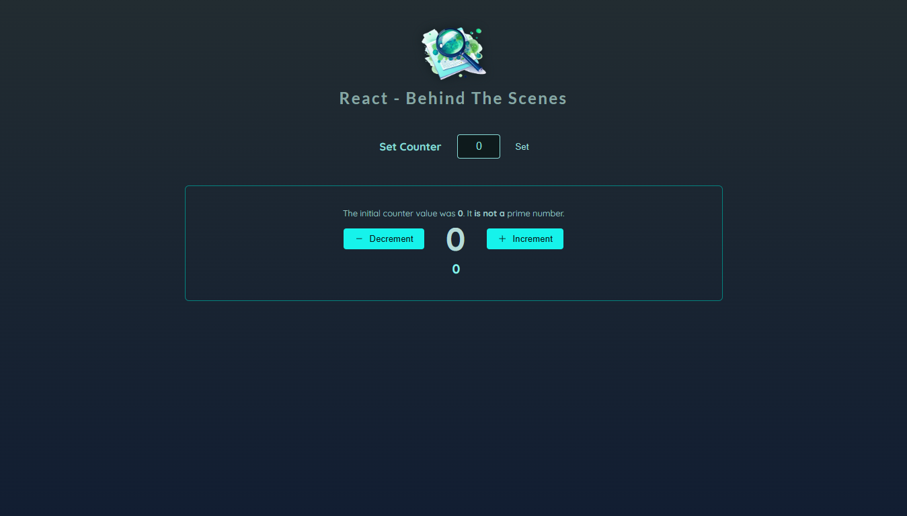

Merci pour la précision, voici une version mise à jour du README, en tenant compte de vos modifications :

---

# **React - Behind the Scenes**

## 🎯 **Description du projet**

**"React - Behind the Scenes"** est un projet visant à approfondir les concepts avancés de React en mettant l'accent sur l'optimisation des performances et la gestion des rendus. L'objectif principal est de limiter les rendus inutiles des composants en s'assurant que seul le composant concerné par une action donnée soit réactualisé.

---

### 🔍 **Fonctionnalités principales :**
- Un compteur interactif avec incrémentation, décrémentation et réinitialisation.
- Un champ pour définir une valeur initiale personnalisée.
- Analyse en temps réel pour déterminer si la valeur du compteur est un nombre premier.
- Optimisation des rendus pour éviter les réactualisations non nécessaires des composants.
- Stylisation moderne avec CSS personnalisé.

---

## 🚀 **Technologies utilisées**

- **React** (avec Vite)
- **CSS** personnalisé pour le design.
- Optimisation des performances via des hooks comme `useCallback` et `useMemo`.
- Gestion des états React avec des hooks natifs.

---

## ✨ **Ce que j'ai appris**

- **Optimisation des rendus dans React :**
  - Utilisation de `useCallback` pour mémoriser les fonctions afin d'éviter leur recréation à chaque rendu.
  - Mise en œuvre de `useMemo` pour limiter les recalculs des valeurs dérivées complexes et éviter les mises à jour inutiles.

- **Gestion des composants :**
  - Mise en place d'une logique pour ne réactualiser que les composants qui en ont besoin, améliorant ainsi les performances de l'application.

- **Meilleures pratiques React :**
  - Architecture modulaire pour un code plus maintenable.
  - Utilisation des hooks avancés pour construire des composants réactifs et performants.

---

## 📸 **Aperçu**



---

## ⚙️ **Installation et exécution**

1. Clonez le dépôt :
   ```bash
   git clone https://github.com/Martialdepaul
Behind-the-Scenes
   ```
2. Installez les dépendances :
   ```bash
   npm install
   ```
3. Lancez le serveur de développement :
   ```bash
   npm run dev
   ```
4. Accédez à l'application dans votre navigateur à l'adresse [http://localhost:3000](http://localhost:3000).

---

## 📄 **Roadmap des améliorations futures**

- Ajouter une fonctionnalité de thèmes (clair/sombre).
- Implémenter des tests unitaires pour valider les hooks et les composants.
- Ajouter des animations fluides pour améliorer l’expérience utilisateur.

---

## 🛠 **Contributions**

Les contributions sont les bienvenues ! N’hésitez pas à ouvrir une issue ou une pull request pour suggérer des améliorations ou signaler un problème.

---

## 🖊 **Auteur**

Projet réalisé par **Martial De-Paul**. Toujours motivé à explorer les profondeurs de React et à optimiser mes projets pour une expérience utilisateur fluide.

---

## 📜 **Licence**

Ce projet est sous licence MIT.

---

Cela correspond-il mieux à votre projet maintenant ? Si vous avez d'autres ajustements ou ajouts, n'hésitez pas à me le dire ! 😊
